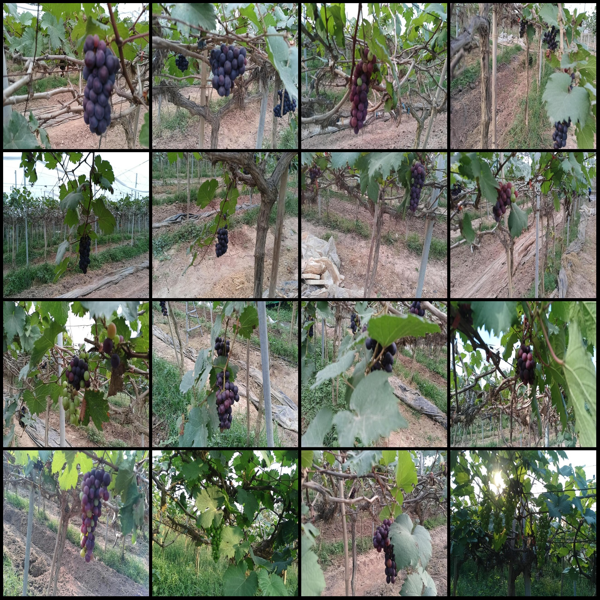
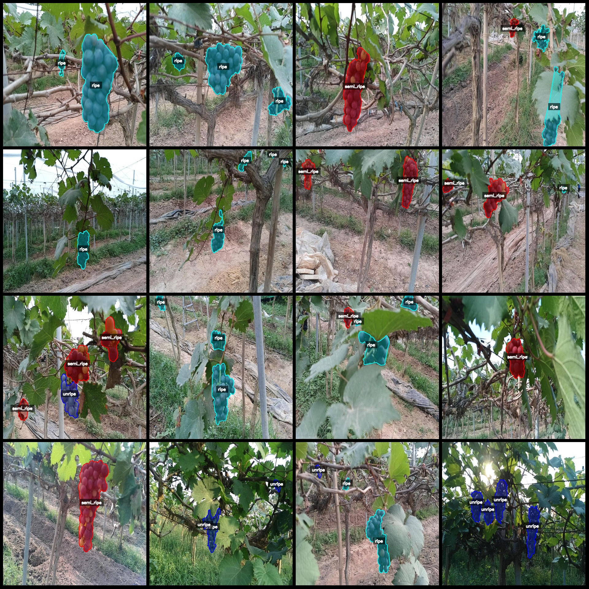
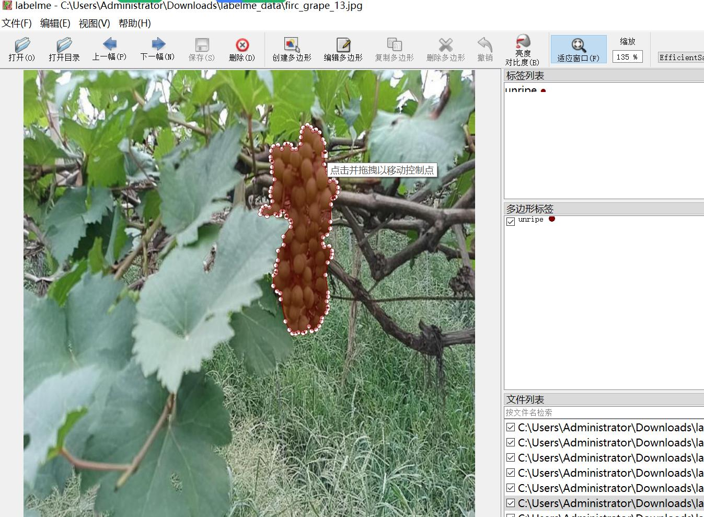

# Intelligent Orchard Grape Maturity Identification and Segmentation Dataset (labelme format) - 6501 Images in 3 Categories

The dataset is in labelme format (excluding the mask file, only containing jpg images and corresponding json files).

Number of images (number of jpg files): 6501
Number of annotations (json file count): 6501
Number of categories: 3
Annotation category names: ["ripe", "semi_ripe", "unripe"]
Each category's number of bounding boxes:
Ripe count = 5345
Semi-ripe count = 5323
Unripe count = 6966
Total bounding box count: 17634
Labelme version used for annotation: 5.5.0
Image resolution: 640x640
Annotation rules: Draw polygons around the categories
Important note: The dataset can be opened and edited using labelme, while the json dataset needs to be converted into either a mask or Yolo format or COCO format for semantic segmentation or instance 
segmentation.
Special declaration: This dataset does not guarantee the accuracy of trained models or weights files.
Image preview:
Annotation example:
Randomly selected 16 images:
Annotation drawing results:
Labelme editing image examples:

## Images

Here is a pay link on Stripe ( https://buy.stripe.com/3cs8yP7sY87d0vu9AB ). Please contact me lonlonago@foxmail.com after funding $89, and I will send you a complete data files , thank you!

